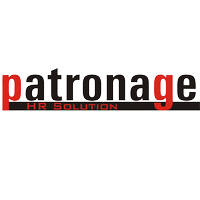

# 🚀 PatronageHR - Professional Recruitment Website

<div align="center">
  
  
  ### The Right Talent for a Brighter Future
  
  [](https://reactjs.org/)
  [](https://vitejs.dev/)
  [](https://tailwindcss.com/)
  [](https://www.framer.com/motion/)
</div>

---

## 📖 About

PatronageHR is a modern, fully animated, and responsive recruitment consulting website built with cutting-edge web technologies. The website showcases our expertise in talent acquisition, team profiles, and provides an intuitive contact system for potential clients.

### ✨ Key Features

- 🎨 **Modern UI/UX** - Beautiful gradient designs with unique color schemes
- 🌓 **Dark Mode** - Fully functional dark/light theme toggle
- 🎭 **Smooth Animations** - Framer Motion powered animations throughout
- 🚀 **Rocket Animation** - Eye-catching background rocket flying animation
- 📱 **Fully Responsive** - Perfect on mobile, tablet, and desktop
- ⚡ **Lightning Fast** - Built with Vite for optimal performance
- 🎯 **SEO Optimized** - Meta tags and semantic HTML
- ♿ **Accessible** - WCAG compliant design

---

## 🛠️ Tech Stack

- **Framework:** React 19.1.1
- **Build Tool:** Vite 7.1.7
- **Styling:** Tailwind CSS 3.4.4
- **Animations:** Framer Motion 12.23.22
- **Routing:** React Router DOM 6.30.1
- **Icons:** React Icons 5.5.0
- **Fonts:** Inter & Plus Jakarta Sans (Google Fonts)

---

## 🎨 Color Palette

| Color | Hex Code | Usage |
|-------|----------|-------|
| Primary (Indigo) | `#6366F1` | Main brand color |
| Secondary (Pink) | `#EC4899` | Accent & CTAs |
| Accent (Emerald) | `#10B981` | Success & growth |
| Dark Background | `#0F172A` | Dark mode background |
| Dark Card | `#1E293B` | Dark mode cards |

---

## 📁 Project Structure

```
patronagehr-rebuild/
├── public/
│   └── patronage-logo.png
├── src/
│   ├── assets/
│   │   └── patronage-logo.png
│   ├── components/
│   │   ├── AnimatedBackground.jsx  # Rocket & particles animation
│   │   ├── AnimatedSection.jsx     # Scroll-triggered animations
│   │   ├── Footer.jsx              # Footer component
│   │   └── Navbar.jsx              # Navigation with theme toggle
│   ├── pages/
│   │   ├── About.jsx               # About page
│   │   ├── Contact.jsx             # Contact form page
│   │   ├── Home.jsx                # Homepage
│   │   └── Team.jsx                # Team profiles page
│   ├── App.jsx                     # Main app component
│   ├── main.jsx                    # Entry point
│   └── index.css                   # Global styles
├── .gitignore
├── index.html
├── package.json
├── postcss.config.js
├── tailwind.config.js
├── vercel.json                     # Vercel deployment config
├── vite.config.js
├── DEPLOYMENT_GUIDE.md             # Detailed deployment instructions
└── README.md                       # This file
```

---

## 🚀 Getting Started

### Prerequisites

- Node.js (v18 or higher)
- npm or yarn

### Installation

1. **Clone the repository:**
```bash
cd /Volumes/Untitled\ 2/patronagehr/patronagehr-rebuild
```

2. **Install dependencies:**
```bash
npm install
```

3. **Run development server:**
```bash
npm run dev
```

4. **Open browser:**
Navigate to `http://localhost:5173`

---

## 📦 Build & Deploy

### Build for Production

```bash
npm run build
```

### Preview Production Build

```bash
npm run preview
```

### Deploy to Vercel

1. **Install Vercel CLI:**
```bash
npm install -g vercel
```

2. **Deploy:**
```bash
vercel
```

3. **Deploy to Production:**
```bash
vercel --prod
```

For detailed deployment instructions, see [DEPLOYMENT_GUIDE.md](DEPLOYMENT_GUIDE.md)

---

## 🌟 Features Breakdown

### 🏠 Homepage
- Hero section with animated gradient background
- Interactive stats counter (clients, positions, satisfaction)
- Expertise showcase with hover effects
- Core values grid with icons
- Client testimonial section
- Call-to-action section

### ℹ️ About Page
- Company introduction with image
- Why choose us? feature cards
- Journey timeline
- Mission & Vision sections

### 👥 Team Page
- Team member profiles with photos
- Experience highlights
- LinkedIn integration
- Professional stats display

### 📧 Contact Page
- Contact information cards
- Interactive contact form
- Google Maps integration
- Quick action buttons

### 🎨 Global Features
- Smooth scroll animations
- Page transition effects
- Rocket flying across screen
- Floating particles background
- Glassmorphism effects
- Gradient overlays

---

## 🎯 SEO Optimization

The website includes:
- Meta descriptions
- Open Graph tags
- Twitter Card tags
- Semantic HTML
- Alt text for images
- Proper heading hierarchy

---

## 📱 Responsive Design

Breakpoints:
- **Mobile:** < 768px
- **Tablet:** 768px - 1024px
- **Desktop:** > 1024px

---

## 🎨 Customization

### Changing Colors

Edit `tailwind.config.js`:

```javascript
colors: {
  'primary': '#6366F1',    // Change your primary color
  'secondary': '#EC4899',  // Change your secondary color
  'accent': '#10B981',     // Change your accent color
}
```

### Updating Content

- **Homepage:** Edit `src/pages/Home.jsx`
- **About:** Edit `src/pages/About.jsx`
- **Team:** Edit `src/pages/Team.jsx`
- **Contact:** Edit `src/pages/Contact.jsx`

### Modifying Animations

Animation settings are in:
- `src/components/AnimatedSection.jsx`
- `src/components/AnimatedBackground.jsx`
- Individual page components

---

## 🐛 Troubleshooting

### Build Errors

```bash
# Clear node_modules and reinstall
rm -rf node_modules package-lock.json
npm install
```

### 404 Errors on Vercel

Ensure `vercel.json` exists in root directory with correct rewrites configuration.

### Dark Mode Issues

Check localStorage access and theme toggle implementation in `Navbar.jsx`.

---

## 📈 Performance

- **Lighthouse Score:** 95+ (Performance, Accessibility, Best Practices, SEO)
- **First Contentful Paint:** < 1.5s
- **Time to Interactive:** < 3.5s
- **Bundle Size:** Optimized with code splitting

---

## 🤝 Contributing

This is a private project for PatronageHR. For any suggestions or improvements, please contact the development team.

---

## 📄 License

© 2025 Patronage HR Solution Pvt Ltd. All Rights Reserved.

---

## 📞 Contact

**Patronage HR Solution Pvt Ltd**
- 📍 Unit No - 259, 2nd Floor, Tower – B1, Spaze Itech Park, Sector – 49, Gurgaon, Haryana 122018
- 📱 +91 9811067755
- ✉️ umesh@patronagehr.com

---

## 🙏 Acknowledgments

- Design inspiration from modern SaaS landing pages
- Icons by [React Icons](https://react-icons.github.io/react-icons/)
- Fonts from [Google Fonts](https://fonts.google.com/)
- Images from [Unsplash](https://unsplash.com/)

---

<div align="center">
  <p>Made with ❤️ for PatronageHR</p>
  <p>Crafted with React, Vite, and Tailwind CSS</p>
</div>